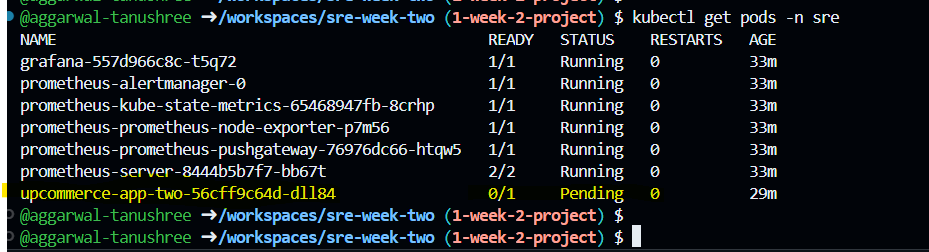
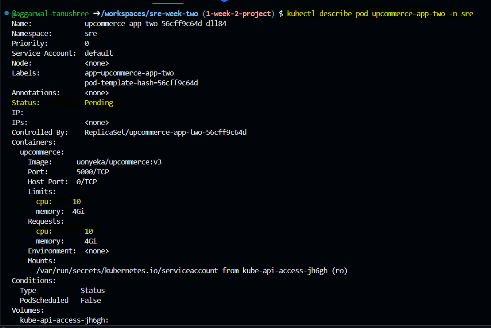
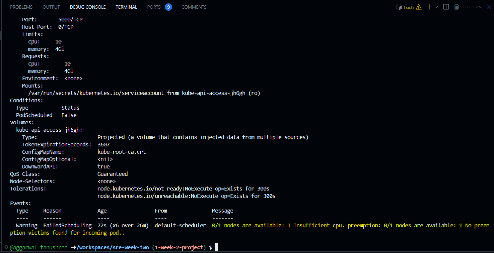
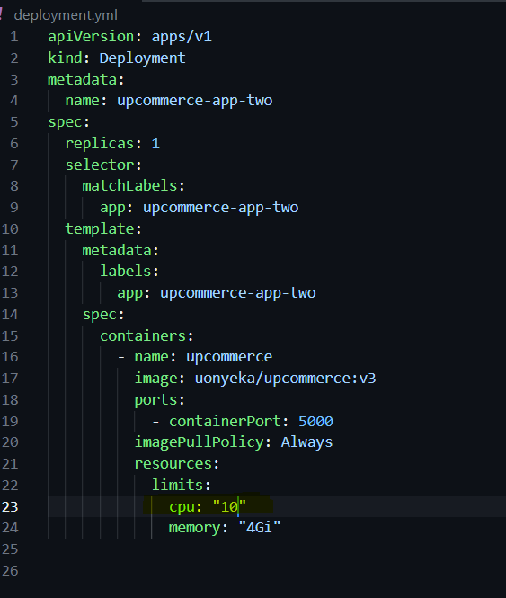
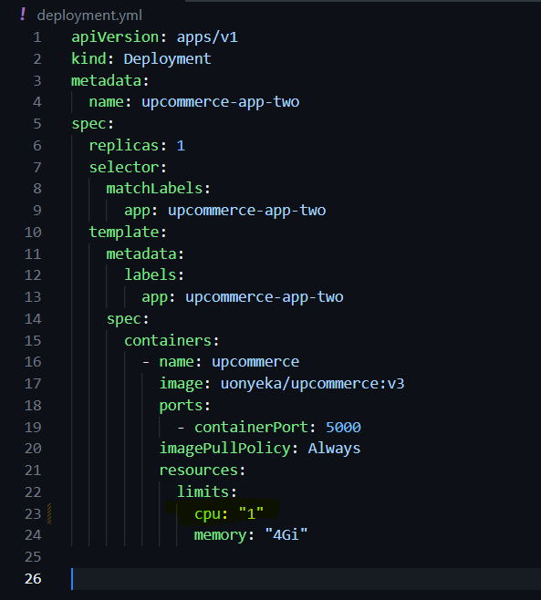
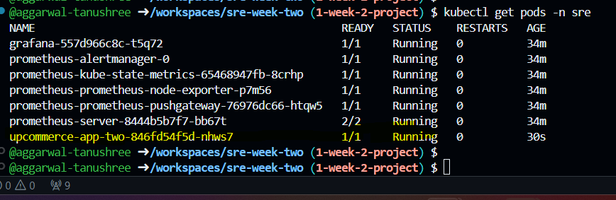
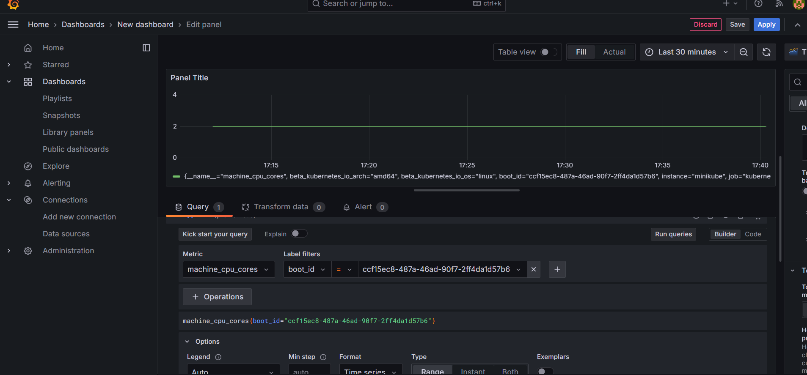

# Troubleshooting

### Checking Pod status
`kubectl get pods -n sre`

### Describing the `upcommerce` pod to get details 

### Incorrect configuration identified

### Corrected configuration

### Upcommerce now running

## Additional Task

### Grafana dashboards created

